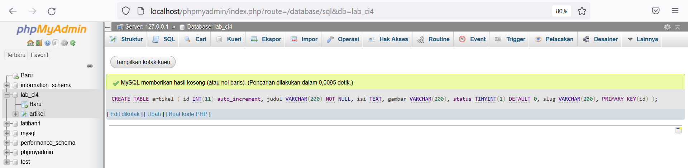
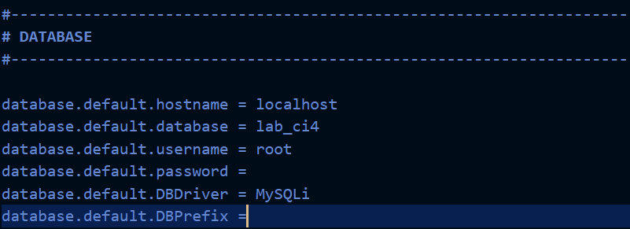
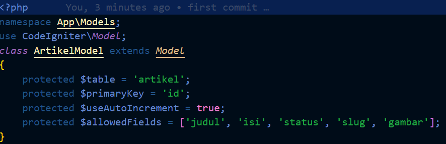
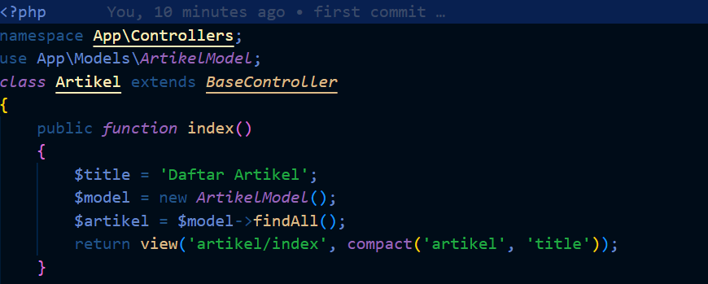
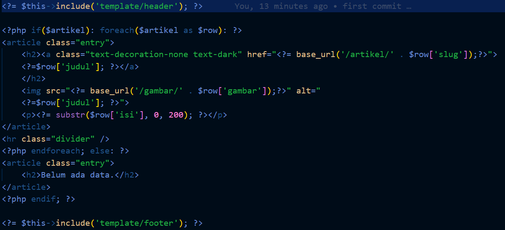
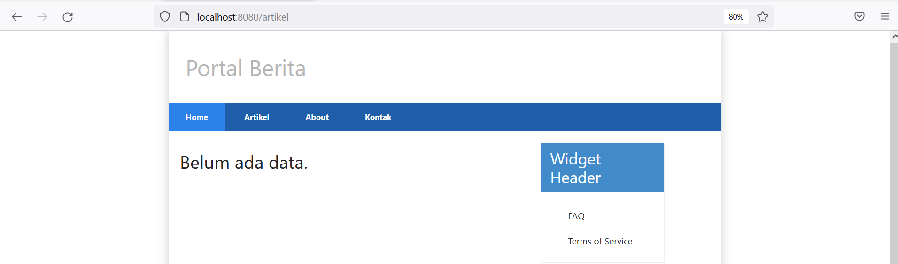
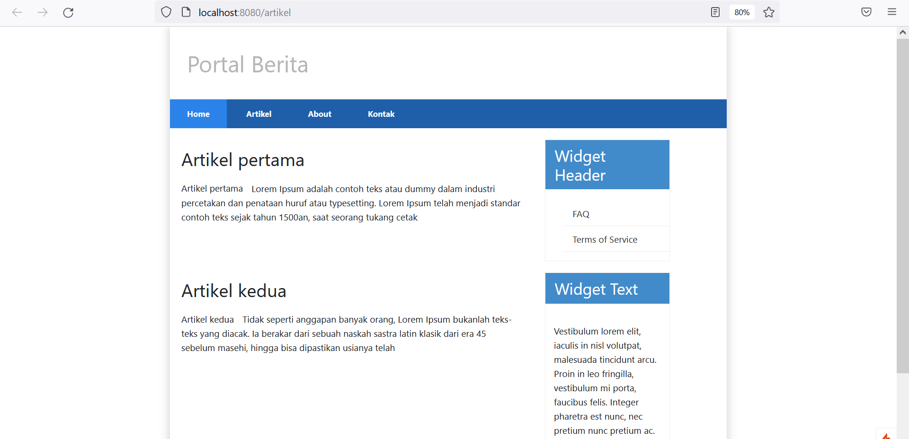
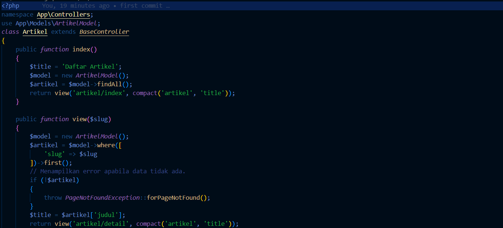
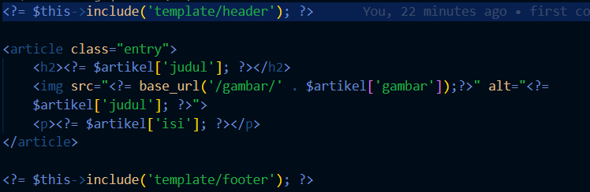

| Nama      | Risky HariAdi |
| ----------- | ----------- |
| NIM     | 312010124    |
| Kelas   | TI.20.A.1        |

## 1. Database
- Jalankan ``Apache, MySql`` pada Xampp, Buat database dengan nama ``lab_ci4`` di http://localhost/phpmyadmin.
- Buat tabel dengan nama ``artikel``.
    ```sql
    CREATE TABLE artikel (
        id INT(11) auto_increment,
        judul VARCHAR(200) NOT NULL,
        isi TEXT,
        gambar VARCHAR(200),
        status TINYINT(1) DEFAULT 0,
        slug VARCHAR(200),
        PRIMARY KEY(id)
    );
    ```

<br>

## 2. Konfigurasi Koneksi Database
- Terletak di folder ``ci4``, file `.env`, Hapus tanda `#`.

<br>

## 3. Membuat Model 
- Terletak di folder `app/Models`, buat file `ArtikelModel.php`.

<br>

## 4. Membuat Controller 
- Terletak di folder `app/Controllers`, buat file `Artikel.php`.

<br>

## 5. Membuat View pada artikel 
- Terletak di folder `app/Views/artikel`, buat file `index.php`.

<br>

- Buka browser, ketik http://localhost:8080/artikel 


<br>

- Masukkan data ke tabel artikel,
    ```sql
    INSERT INTO artikel (judul, isi, slug) VALUE
    ('Artikel pertama', 'Lorem Ipsum adalah contoh teks atau dummy dalam industri 
    percetakan dan penataan huruf atau typesetting. Lorem Ipsum telah menjadi 
    standar contoh teks sejak tahun 1500an, saat seorang tukang cetak yang tidak 
    dikenal mengambil sebuah kumpulan teks dan mengacaknya untuk menjadi sebuah 
    buku contoh huruf.', 'artikel-pertama'), 
    ('Artikel kedua', 'Tidak seperti anggapan banyak orang, Lorem Ipsum bukanlah 
    teks-teks yang diacak. Ia berakar dari sebuah naskah sastra latin klasik dari 
    era 45 sebelum masehi, hingga bisa dipastikan usianya telah mencapai lebih 
    dari 2000 tahun.', 'artikel-kedua');
    ``` 
<br>

- Refresh kembali browser.

<br>

## 6. Membuat Tampilan detail Artikel
- Terletak di folder `app/Controllers`, edit file `Artikel.php`. Tambah method ``view()``.

<br>

## 7. Membuat View pada Detail
- Terletak di folder `app/Views/artikel`, buat file `detail.php`.

<br>

## 8. Membuat Routing untuk artikel detail
- Terletak di folder `app/Config`, edit file `Routes.php`.

<br>

- Klik `Artikel Kedua` pada http://localhost:8080/artikel, untuk pindah ke detailnya.

<br>

## 9. Membuat Menu admin
- Terletak di folder `app/Controller`, edit file `Artikel.php`. Tambah method `admin_index()`.

<br>

- Selanjutnya, akses kembali folder `app/Views/artikel`, buat file `admin_index.php`.
    ```php
    <?= $this->include('template/admin_header'); ?>
    <table class="table table-bordered table-hover">
        <thead>
            <tr class="table-primary">
                <th scope="col">ID</th>
                <th scope="col">Judul</th>
                <th scope="col">Status</th>
                <th scope="col">Aksi</th>
            </tr>
        </thead>
        <tbody>
            <?php if($artikel): foreach($artikel as $row): ?>
            <tr>
                <td><?= $row['id']; ?></td>
                <td>
                    <b><?= $row['judul']; ?></b>
                    <p><small><?= substr($row['isi'], 0, 50); ?></small></p>
                </td>
                <td><?= $row['status']; ?></td>
                <td>
                    <a class="btn btn-primary p-1" href="<?= base_url('/admin/artikel/edit/' . 
                    $row['id']);?>">Ubah</a>
                    <a class="btn btn-danger p-1" onclick="return confirm('Yakin menghapus data?');" href="<?= base_url('/admin/artikel/delete/' . 
                    $row['id']);?>">Hapus</a>
                </td>
            </tr>
            <?php endforeach; else: ?>
            <tr>
                <td colspan="4">Belum ada data.</td>
            </tr>
            <?php endif; ?>
        </tbody>
        <tfoot>
            <tr class="table-primary">
                <th scope="col">ID</th>
                <th scope="col">Judul</th>
                <th scope="col">Status</th>
                <th scope="col">Aksi</th>
            </tr>
        </tfoot>
    </table>
    <?= $this->include('template/admin_footer'); ?>
    ```
<br>

- Buka folder yang ada di ``app/Views/artikel/template``, kemudian buat:
- ``admin_header.php``,

<br>

- ``admin_footer.php``

<br>

## 10. Membuat Routing untuk menu admin
- Terletak di folder `app/Config`, edit file `Routes.php`.

<br>

- Akses browser dengan http://localhost:8080/admin/artikel.

<br>

## 11. Menambah data untuk Artikel
- Terletak di folder `app/Controller`, edit file `Artikel.php`. Tambah method `add()`.

<br>

- Akses kembali folder `app/Views/artikel`, buat file `form_add.php`.

<br>

- Akses browser dengan http://localhost:8080/admin/artikel/add.

<br>

## 12. Mengubah data pada Artikel
- Terletak di folder `app/Controller`, edit file `Artikel.php`. Tambah method `edit()`.

<br>

- Akses kembali folder `app/Views/artikel`, buat file `form_edit.php`.

<br>

- Akses browser dengan http://localhost:8080/admin/artikel/edit/1 untuk Mengubah artikel pertama.

<br>

## 13. Menghapus data pada Artikel
- Terletak di folder `app/Controller`, edit file `Artikel.php`. Tambah method `delete()`.

<br>

- Akses browser dengan http://localhost:8080/admin/artikel/add untuk membuat artikel ketiga, lalu `kirim`.

<br>

- Untuk mengeceknya ketik di url, http://localhost:8080/artikel kemudian enter.

<br>

- Pergi ke menu admin untuk menghapusnya, http://localhost:8080/admin/artikel, kemudian pilih `hapus`.

<br>

- Artikel berhasil dihapus.

<br>
</div>